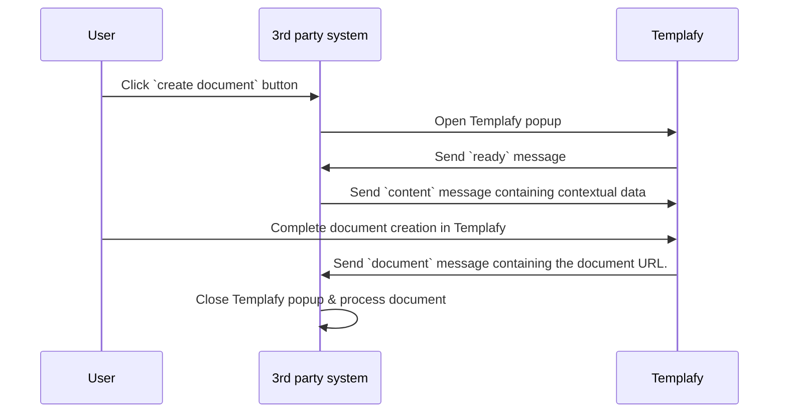

# Templafy App Connector
App Connector allows Templafy to load within a third-party application. This means you can surface Templafy from all the most used workplace applications and design supportive workflows.

With the App Connector you can:
- Get access to Templafy and document composer from most used workplace applications.​
- Get optimized content suggestions based on application and user profile information.​
- Get a unified end-user experience across applications.
- Use contextual data provided by the 3rd-party app connector.

## Prerequisites
- App connector must be hosted on HTTPS to ensure information security.
- 3rd-party application needs to be able to host custom components and use Javascript.
- 3rd-party application is able to open popups and use [PostMessage API](https://developer.mozilla.org/en-US/docs/Web/API/Window/postMessage).

## How it works
This integration opperates entirely in the browser using Javascripts [PostMessage API](https://developer.mozilla.org/en-US/docs/Web/API/Window/postMessage). This means that there's no network interaction between Templafy and the integrating system, in theory this means that this integration can also work with systems not exposed on the internet.

This integration works by interacting with Templafy using messages, highover to integration works like this:
1. 3rd-party opens Templafy popup.
2. Templafy sends `ready` message to indicate it's ready to receive `content`.
3. 3rd-party replies to `ready` by sending a `content` message in JSON format.
4. User is now able to complete document generation in Templafy.
5. When document generation is done Templafy sends a `document` message containing a document URL (with Shared-Access Signature).
6. 3rd-party closes Templafy popup.

### Sequence diagram

## Using the example
1. Setup a custom app connector on your Templafy tenant, more on that [here](https://support.templafy.com/hc/en-us/articles/360018358678-How-to-enable-a-Custom-App-Connector-).
    - For domain name fill in `localhost:3000`.
2. Open a command line window to where you clone this repository (i.e. `c:\gitprojects\`).
3. Check out this repository to your machine: `git clone https://github.com/templafy/AppConnectorLibrary.git`
4. Navigate to `examples/app-connector` folder: `cd ./AppConnectorLibrary/examples/app-connector/`
5. Run `npm install`.
6. Run `npm start`.
7. Open the example app on [https://localhost:3000](https://localhost:3000).
> You might get a certificate warning here as this uses a self signed SSL certificate for hosting the app, you can continue this prompt to get to the app connector example.
8. Fill in the Templafy popup URL
> This can be retrieved from the Templafy integrations portal. Go to the app connector that was setup in step 1 and click on `View details`. On the popup there will be a "copy" button next to the `Popup URL` field, click and paste it into the app connector example `Popup URL` input box.
9. (Optional) Update content JSON to match your use case.
10. Click the `Open popup` button
11. Complete the document creation in Templafy and click `Save back to [The display name for your app connector here]` button.
12. The document should be downloaded and the URL should be visible in the `Document URL` box.
